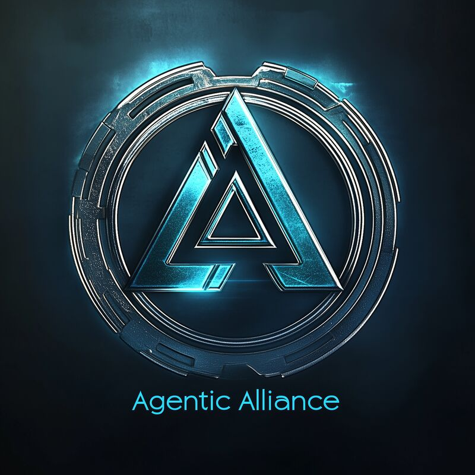

# Agentic AI - Advancing Agent Frameworks

Welcome to **Agentic AI**, a collaborative initiative focused on exploring and advancing agentic frameworks. This repository serves as a hub for cutting-edge research, community collaboration, and comprehensive documentation for innovators, researchers, and developers working on the future of artificial intelligence.

---

## 🌟 Vision

Our goal is to shape the next generation of agentic AI by fostering innovation, research, and implementation. We're building a global community of researchers and developers pioneering the future of autonomous systems and AI frameworks.

---

## 🚀 Features

### 1. **Research Hub**

- Dive into groundbreaking research on agentic systems and AI frameworks
- Get early access to emerging technologies and help define industry standards

### 2. **Community**

- Join a thriving ecosystem of AI innovators and researchers
- Collaborate on cutting-edge projects and accelerate collective growth

### 3. **Documentation**

- Access battle-tested implementation guides and reference architectures
- Learn from real-world case studies and industry best practices

---

## 🌍 Join the Mission

Be part of the community shaping the future of autonomous systems and AI. Connect, contribute, and innovate together.

Visit our [GitHub Wiki](https://github.com/agenticalliance/agenticalliance.com/wiki) for detailed documentation and project information.

---

## 🤝 Current Alliance Projects

Connect with our partner initiatives advancing the future of AI and robotics:

- [Sandy Mount](https://sandy-mount.com/) - Pioneering autonomous systems research
- [AI & Robotic Labs](https://ai-robotic-labs.github.io/ai-robotic-labs/) - Cutting-edge robotics and AI integration
- [Narrative Goldmine](https://narrativegoldmine.com/#/page/agentic%20alliance) - AI-driven narrative intelligence

---

**© 2024 Agentic AI** - Advancing the future of autonomous systems.
